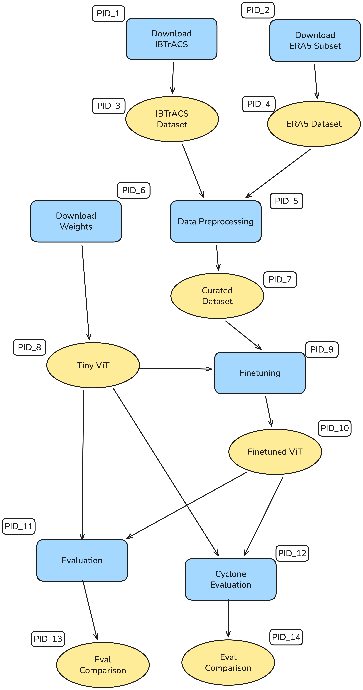

# TinyViT Models for Cyclone Tracking?

This repository explores whether Tiny Vision Transformers (TinyViT) can learn complex geophysical behaviors—specifically tropical cyclone detection and tracking—using reanalysis and best-track data.

### Overview

We combine IBTrACS storm-track records with ERA5 atmospheric fields to create a supervised dataset for cyclone-centered learning. A pretrained TinyViT model is then finetuned for spatiotemporal pattern recognition relevant to cyclone identification, intensity estimation, and trajectory prediction.

### Project Phases

 - **Download IBTrACS** — Retrieve global historical cyclone best-track metadata from NOAA for ground-truth labels.
 - **Download ERA5** — Extract atmospheric reanalysis fields needed for cyclone-related predictors (e.g., winds, pressure, humidity).
 - **Preprocess Datasets** — Align grids, synchronize timestamps, crop storm-centric windows, and generate training/validation samples.
 - **Download TinyViT** — Pull lightweight pretrained TinyViT checkpoints for efficient geophysical image modeling.
 - **Finetune TinyViT** — Train the model on cyclone-labeled samples to learn storm signatures and motion patterns.
 - **General Evaluation** — Assess model performance on broad meteorological feature recognition tasks.
 - **Cyclone-Specific Eval** — Measure skill in detecting storms, estimating intensity, and predicting track displacement.

### Goals

- Evaluate whether compact transformer models can learn complex climate dynamics.
- Provide a reproducible pipeline for cyclone-centric machine learning.
- Benchmark TinyViT in a domain traditionally dominated by CNNs and physical models.
- Create end-to-end provenance pipeline